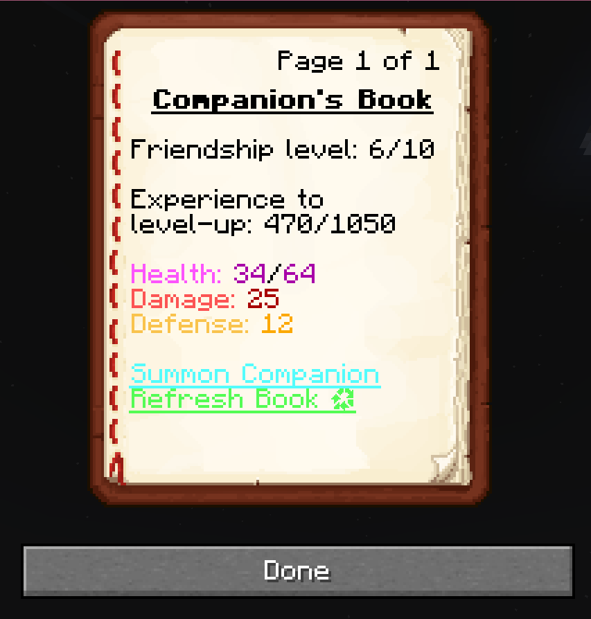
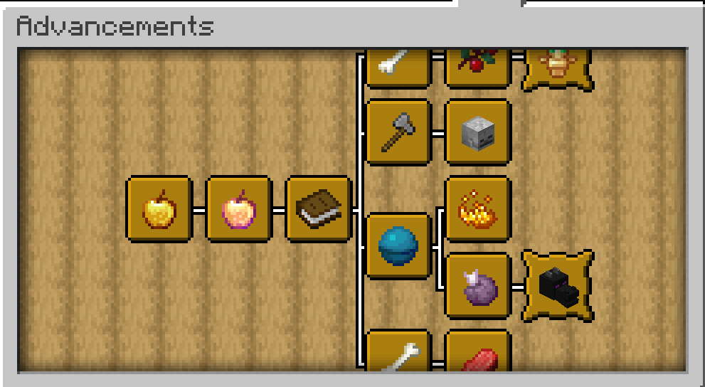

# Companions

Companions is a minecraft datapack for 1.19 that improves the usefulness and interactions with pets (wolves)! Each player can choose one tamed wolf to be their companion and interact with them through a GUI.

The datapack includes 11 progression based advancements:

And more features, such as:
- A friendship system, where you increase your friendship with your companion by fighting together and spending time together
- Increasing your companion's friendship means your companion's stats will increase, such as its health and damage to the point of becoming a very effective teammate in combat. Higher friendship levels also mean being able to get better gifts, and better gifts become more common
- Companions will randomly find a gift to give you, to collect the gift approach your companion. Worse gifts, like diamonds, are more common, better gifts, like nether stars, are more rare.
- The gifts companions find their owners are based on the dimension they are in, for example, you might receive a shulker shell in the end dimension, netherite scraps in the nether or totems of undying in the overworld. Theses items are exclusive to one dimension, though some can be received in multiple dimensions.

## Getting Started
This datapack is able to be installed like any other datapack, without extra configuration or things you must do to setup.

---

Download the latest version of the datapack [here](https://github.com/supercam19/Companions/releases/latest)

[Use this tutorial to learn how to install datapacks](https://www.planetminecraft.com/blog/how-to-download-and-install-minecraft-data-packs/)

---

Once this datapack has been installed on your world you may go ahead and tame a wolf or find one already tamed. Throw a golden apple to it and it will become your companion. To view the helpful GUI, throw a book at your companion to receive the a written book, which serves as the GUI.